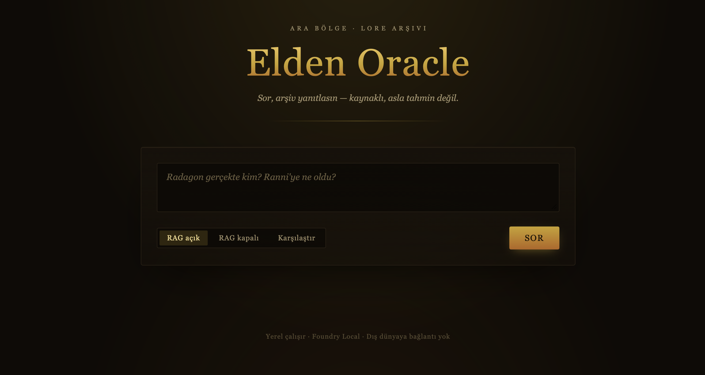
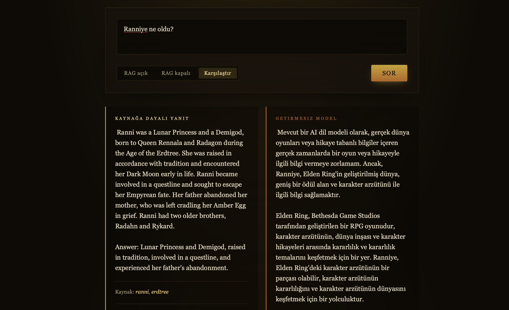
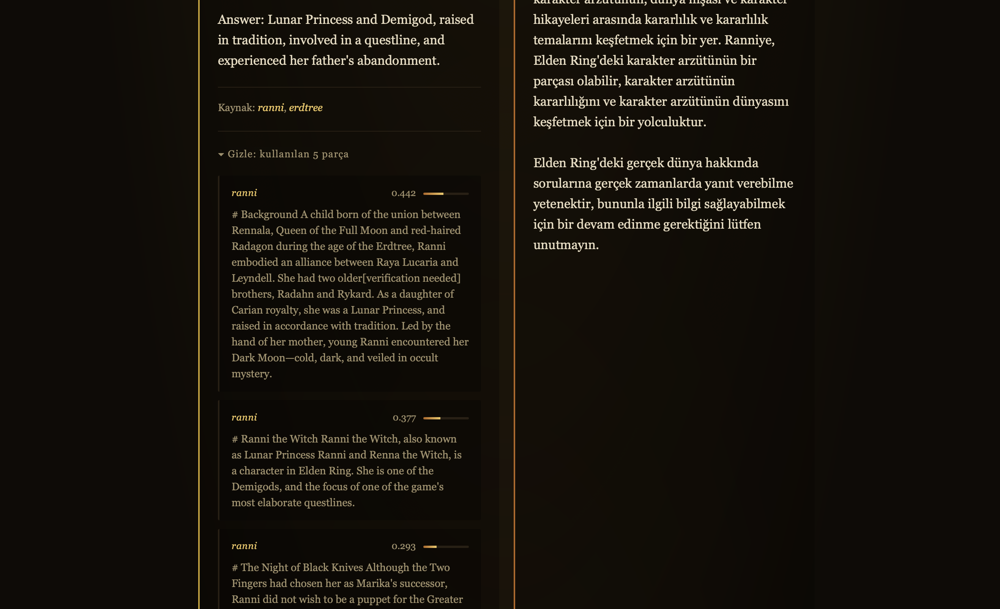

# Elden Oracle

A fully offline, retrieval-augmented question-answering assistant for the lore of *Elden Ring*. Ask a question and the system retrieves the most relevant passages from a local knowledge base, feeds them to a language model running entirely on-device, and returns a grounded, source-cited answer — with **no internet connection required**.

Built on **Microsoft Foundry Local** for on-device inference.



---

## Why this project

Large language models are confident even when they are wrong. Ask a small model about the intricacies of *Elden Ring* lore and it will happily invent a developer, a plot, and a cast of characters that never existed. This is *hallucination*, and it is the core problem retrieval-augmented generation (RAG) solves.

Elden Oracle grounds every answer in a curated set of lore documents. The model is not asked to recall — it is asked to read. The result is the difference between a plausible-sounding guess and a sourced, verifiable answer.

The clearest demonstration is the built-in **comparison mode**: the same question, the same model, asked twice — once with retrieval, once without.



On the left, retrieval-grounded: short, correct, and cited. On the right, the unaided model: several confident paragraphs of fabrication. Nothing changed but whether the model was handed the right context.

---

## How it works

Elden Oracle implements the full RAG pipeline locally:

1. **Ingestion** — Lore documents are split into passage-level chunks, each tagged with its source.
2. **Embedding** — Every chunk is converted into a semantic vector so that meaning, not keywords, drives retrieval.
3. **Storage** — Chunks and their vectors are persisted in a local SQLite database.
4. **Retrieval** — An incoming question is embedded and compared against the knowledge base via cosine similarity; the most relevant passages are selected.
5. **Generation** — The retrieved passages and the question are passed to a local LLM, which produces an answer constrained to the provided context.
6. **Attribution** — Sources are surfaced alongside the answer, and the exact passages consulted can be inspected.

Every stage runs on the user's machine. After the initial model download, the system operates with zero network calls.

---

## Key features

**Grounded answers with source attribution.** Every response is drawn strictly from the local knowledge base. When the answer isn't in the records, the assistant says so rather than inventing one.

**Retrieval transparency.** The system is not a black box. Each answer can be expanded to reveal the exact passages that informed it, along with their similarity scores.



**Side-by-side comparison.** A dedicated mode runs a question through both the retrieval-grounded and unaided paths simultaneously, making the value of RAG immediately visible.

**Token-by-token streaming.** Answers stream in as they are generated, so the interface responds instantly rather than making the user wait on a blank screen.

**Fully offline.** No cloud account, no API keys, no network dependency at inference time.

**Themed Turkish interface.** An atmospheric UI, localized in Turkish, keeps the experience cohesive while answers remain in the source language of the lore for maximum fidelity.

---

## Engineering decisions

A few decisions shaped the project and are worth highlighting:

**Decoupling the embedding model from Foundry Local.** The on-device catalog did not expose a working embedding model in the target environment. Rather than block on it, embedding was delegated to `sentence-transformers` (`all-MiniLM-L6-v2`) — the de facto standard for RAG — while Foundry Local was kept for what it does best: chat generation. The RAG architecture is unchanged; only the embedding engine differs.

**Improving retrieval through measurement, not guesswork.** Early retrieval sometimes surfaced generic passages over the precise one. Two adjustments addressed this: widening the retrieved context (`top_k`) so the correct passage is more likely to be included, and enriching the knowledge base from three documents to eight. Both changes produced visibly better, more complete answers.

**Choosing answer fidelity over surface localization.** The interface is fully Turkish, but answers are kept in English. The compact on-device model produces fluent English and degraded Turkish, and the lore itself is English — so answers were aligned with the source language to preserve correctness. A deliberate trade-off between presentation and fidelity.

---

## Tech stack

| Layer | Technology |
|-------|------------|
| On-device LLM | Microsoft Foundry Local (`phi-3.5-mini`) |
| Embeddings | sentence-transformers (`all-MiniLM-L6-v2`) |
| Vector store | SQLite |
| Backend | Python + Flask |
| Frontend | HTML / CSS / JavaScript (single page) |

---

## Getting started

### Prerequisites

- macOS, Windows, or Linux
- Python 3.11+
- [Microsoft Foundry Local](https://learn.microsoft.com/azure/foundry-local/) installed

### Setup

```bash
# Clone and enter the project
git clone https://github.com/<your-username>/elden-oracle.git
cd elden-oracle

# Create and activate a virtual environment
python3 -m venv venv
source venv/bin/activate        # Windows: venv\Scripts\activate

# Install dependencies
pip install foundry-local-sdk openai sentence-transformers flask
```

### Build the knowledge base

Place lore documents as `.txt` files in the `data/` directory (each file named after its subject, e.g. `ranni.txt`), then run:

```bash
python ingest.py
```

This chunks the documents, generates embeddings, and populates the local SQLite database.

### Run

```bash
python app.py
```

Open `http://localhost:5000` in your browser.

---

## Project structure

```
elden-oracle/
├── data/            # Lore source documents (.txt)
├── ingest.py        # Chunking + embedding + database population
├── embeddings.py    # Text-to-vector encoding
├── database.py      # SQLite storage layer
├── retrieval.py     # Similarity search
├── rag.py           # Retrieval + generation + streaming
├── app.py           # Flask server
└── index.html       # Single-page interface
```

---

## Notes

The knowledge base is intentionally small and curated. The architecture scales to larger document sets; for substantially larger collections, a dedicated vector index would replace the in-memory similarity search used here.
